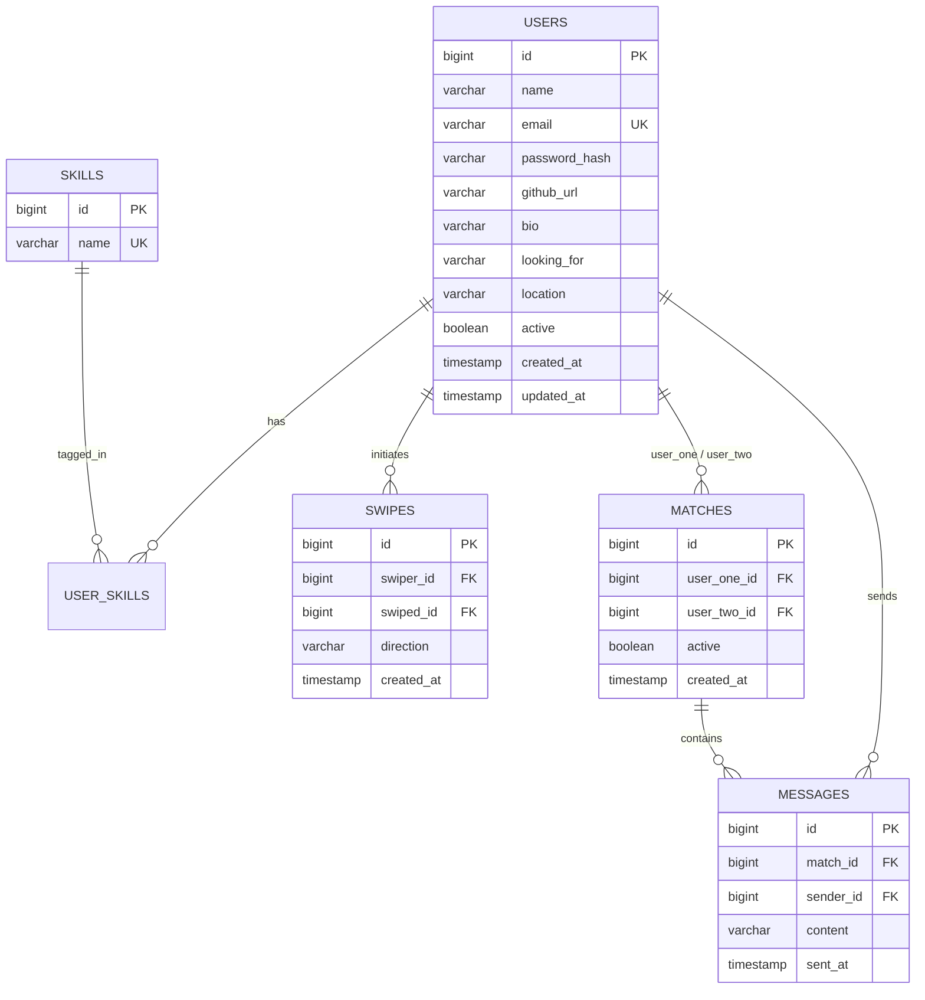

# Devlynix (DevTinder) — Backend API & Real-Time Matchmaking Service

> **Developed for Devlynix Buildathon 2.0 (72-hour Hackathon)**  
> Teammate and project partner matchmaking platform designed for developers and hackathon participants. Swipe on developer cards, discover complementary skill sets, match when interest is mutual, and collaborate in real-time chat.

---

## 🚀 Live Demo & Links
- **Frontend App:** [Devlynix Live on Vercel](https://devlynix-frontend12-git-main-hxmblevishus-projects.vercel.app/)
- **Backend API Base:** `https://<your-backend-domain>/api`
- **Health Check Endpoint:** `GET /api/health`

---

## 🛠 Tech Stack

- **Core Framework:** Java 21 (LTS) & Spring Boot 3.3.5
- **Security & Identity:** Spring Security, JJWT (`0.12.6`), BCrypt Password Encoder
- **Database & Persistence:** PostgreSQL, Spring Data JPA, Hibernate ORM
- **Real-Time Communication:** Spring WebSocket, STOMP Protocol, SockJS fallback
- **Protection & Reliability:** Sliding-Window In-Memory Rate Limiting (`RateLimitFilter`), Dynamic CORS mapping
- **DevOps & Containers:** Docker (Multi-stage build), Docker Compose, Maven 3.9+
- **Testing:** JUnit 5, H2 Database (PostgreSQL compatibility mode)

---

## 🏗 Architecture & System Overview

```
                      +---------------------------------------+
                      |   Next.js Frontend (Vercel)           |
                      |   Retro Cassette UI / Real-time Chat  |
                      +-------------------+-------------------+
                                          |
                        HTTPS (REST API)  |   WSS (STOMP / SockJS)
                                          v
+-------------------------------------------------------------------------------+
|                        Devlynix Spring Boot 3.3 Backend                       |
|                                                                               |
|  [RateLimitFilter] -> [JwtAuthenticationFilter] -> [Spring Security Chain]    |
|                                                                               |
|   +-------------------+  +--------------------+  +-------------------------+  |
|   |  AuthController   |  | DiscoverController |  |     ChatController      |  |
|   |  (Login/Register) |  | (Feed / Swiping)   |  | (Message History / REST)|  |
|   +-------------------+  +--------------------+  +-------------------------+  |
|   |  ProfileController|  |  MatchController   |  |   ChatMessageHandler    |  |
|   |  (Self Management)|  |  (Mutual Matches)  |  |   (WebSocket @Message)  |  |
|   +-------------------+  +--------------------+  +-------------------------+  |
|                                                                               |
|                   [SimpleBroker: /topic/matches/{matchId}]                    |
+---------------------------------------+---------------------------------------+
                                        |
                            Spring Data JPA (Hibernate)
                                        |
                                        v
                       +---------------------------------+
                       |      PostgreSQL Database        |
                       | (Users, Skills, Swipes, Matches,|
                       |            Messages)            |
                       +---------------------------------+
```

---

## 🎯 Key Features & How They Work

### 1. Skill-Based Discovery & Smart Ranking
- The discover feed query (`UserRepository.findDiscoverableUsers`) filters out:
  1. The requesting user.
  2. Users marked as inactive.
  3. Developers the current user has already swiped on (`LIKE` or `PASS`).
- **Dynamic Relevance Ranking:** Matches candidates based on total shared skills (`sharedSkillCount`) sorted in descending order so the most compatible collaborators appear first.
- Optional query filter: `GET /api/discover?skill=react` to narrow search by a specific tech stack.

### 2. Mutual Match & Swipe Engine
- Swiping (`POST /api/discover/swipe`) supports `LIKE` and `PASS`.
- State is tracked in the `swipes` table with a unique composite constraint `(swiper_id, swiped_id)`.
- When User A swipes `LIKE` on User B, the service checks if User B has already swiped `LIKE` on User A:
  - If **mutual**: A `Match` record is generated in the `matches` table and returned with `isMatch: true`.
  - If **one-way**: Returns `isMatch: false` until reciprocal interest is shown.

### 3. Real-Time Chat (WebSockets + STOMP)
- Real-time direct messaging between matched users.
- Match participants subscribe to `/topic/matches/{matchId}`.
- Messages are broadcast to active socket clients and persisted asynchronously into PostgreSQL (`messages` table) with full timestamp and sender info.
- Full REST endpoints available for loading prior chat history or sending fallback messages.

### 4. Sliding-Window Rate Limiting
- Custom `RateLimitFilter` tracks request volume per client IP across a 60-second sliding window (`requestsPerMinute: 60`).
- Responds with `429 Too Many Requests` and standard HTTP headers (`X-RateLimit-Limit`, `X-RateLimit-Remaining`, `X-RateLimit-Reset`).

---

## 🗄 Database Schema (ERD)



---

## 📡 REST API Reference

### 🔐 Authentication (`/api/auth`)

| Method | Endpoint | Description | Auth Required |
|---|---|---|---|
| `POST` | `/api/auth/register` | Register a new developer account | No |
| `POST` | `/api/auth/login` | Authenticate and obtain JWT bearer token | No |

**Register Request Body:**
```json
{
  "name": "Jane Developer",
  "email": "jane@example.com",
  "password": "Password123!",
  "githubUrl": "https://github.com/janedev",
  "bio": "Full-stack developer passionate about building AI agents and UI systems.",
  "lookingFor": "Hackathon teammates & open-source collaborators",
  "location": "Remote / Bengaluru",
  "skills": ["Java", "Spring Boot", "React", "PostgreSQL"]
}
```

**Auth Response:**
```json
{
  "token": "eyJhbGciOiJIUzI1NiIsInR5cCI6IkpXVCJ9...",
  "profile": {
    "id": 1,
    "name": "Jane Developer",
    "email": "jane@example.com",
    "githubUrl": "https://github.com/janedev",
    "bio": "Full-stack developer...",
    "lookingFor": "Hackathon teammates & open-source collaborators",
    "location": "Remote / Bengaluru",
    "skills": ["Java", "Spring Boot", "React", "PostgreSQL"]
  }
}
```

---

### 👤 Profile (`/api/profile`)

| Method | Endpoint | Description | Auth Required |
|---|---|---|---|
| `GET` | `/api/profile/me` | Fetch authenticated user profile | Bearer Token |
| `PUT` | `/api/profile/me` | Update bio, location, looking-for, and skills | Bearer Token |

---

### 🔍 Discovery & Matching (`/api/discover` & `/api/matches`)

| Method | Endpoint | Description | Auth Required |
|---|---|---|---|
| `GET` | `/api/discover` | Discover unswiped developers sorted by shared skills | Bearer Token |
| `GET` | `/api/discover?skill=React` | Filter discoverable developers by specific skill | Bearer Token |
| `POST` | `/api/discover/swipe` | Swipe on a developer (`LIKE` or `PASS`) | Bearer Token |
| `GET` | `/api/matches` | Get list of all mutual matches | Bearer Token |

**Swipe Request:**
```json
{
  "targetUserId": 2,
  "direction": "LIKE"
}
```

**Match Response:**
```json
{
  "matchId": 4,
  "matchedUser": {
    "id": 2,
    "name": "Alex Smith",
    "email": "alex@example.com",
    "skills": ["React", "UI/UX", "Figma"]
  },
  "matchedAt": "2026-10-01T12:00:00Z",
  "isMatch": true
}
```

---

### 💬 Chat (`/api/chat`)

| Method | Endpoint | Description | Auth Required |
|---|---|---|---|
| `GET` | `/api/chat/{matchId}/messages` | Get message history for a match | Bearer Token |
| `POST` | `/api/chat/{matchId}/messages` | Send message via REST endpoint | Bearer Token |

---

## ⚡ WebSocket (STOMP) Guide

- **Connection URL:** `wss://<backend-domain>/ws` (or `http(s)://<domain>/ws` via SockJS)
- **Message Broker Topic:** `/topic/matches/{matchId}`
- **Application Destination Prefix:** `/app`

### 1. Connection (SockJS / STOMP Client)
```javascript
import SockJS from 'sockjs-client';
import Stomp from 'stompjs';

const socket = new SockJS('https://<your-backend>/ws');
const stompClient = Stomp.over(socket);

stompClient.connect({}, (frame) => {
    console.log('Connected to Devlynix WS: ' + frame);

    // Subscribe to match chat room
    stompClient.subscribe('/topic/matches/' + matchId, (message) => {
        const payload = JSON.parse(message.body);
        console.log('New message received: ', payload);
    });
});
```

### 2. Send Message via STOMP
```javascript
stompClient.send('/app/chat.send', {}, JSON.stringify({
    senderEmail: "jane@example.com",
    matchId: 4,
    content: "Hey Alex! Loved your UI projects. Want to team up?"
}));
```

---

## 💻 Local Development Setup

### Prerequisites
- **Java 21 JDK** installed (`java -version`)
- **Maven 3.9+** installed (`mvn -version`)
- **PostgreSQL 15+** or **Docker**

### Option A: Running with Docker Compose (Recommended)
Spins up both PostgreSQL and the Spring Boot backend in one command:
```bash
docker compose up --build
```
The application will be live at `http://localhost:8080`.

### Option B: Running with Local Maven & PostgreSQL
1. Ensure your local PostgreSQL instance is running on port 5432 with database `devtinder`:
   ```sql
   CREATE DATABASE devtinder;
   ```
2. Copy `.env.example` to your environment variables or export them:
   ```bash
   export SPRING_DATASOURCE_URL="jdbc:postgresql://localhost:5432/devtinder"
   export SPRING_DATASOURCE_USERNAME="postgres"
   export SPRING_DATASOURCE_PASSWORD="yourpassword"
   export JWT_SECRET="your-32-character-secret-key-goes-here"
   ```
3. Run with Maven:
   ```bash
   mvn clean spring-boot:run
   ```
4. Run automated test suite:
   ```bash
   mvn test
   ```

---

## 🌐 Cloud Deployment Guide (Free & Affordable Options)

Since Railway trial periods expire, here are the best zero-cost and production-ready setups:

### 1. Render.com (Backend) + Neon.tech (PostgreSQL) — **100% Free**

#### Step 1: Create Free PostgreSQL Database on Neon
1. Go to [Neon.tech](https://neon.tech) and sign up (Free 0.5 GB PostgreSQL forever).
2. Create a new project named `devlynix-db`.
3. In your Neon dashboard, copy the **Connection Details** (JDBC or Connection string):
   - Host: `ep-xyz.aws.neon.tech`
   - Database: `neondb`
   - User: `neondb_owner`
   - Password: `<password>`
4. Construct your JDBC URL:
   `jdbc:postgresql://ep-xyz.aws.neon.tech/neondb?sslmode=require`

#### Step 2: Deploy Spring Boot on Render
1. Push your code to your GitHub repository.
2. Go to [Render.com](https://render.com) -> **New** -> **Web Service**.
3. Connect your repository (`Devlynix-Buildathon-2.0`).
4. Set Environment to **Docker** (Render will detect the included `Dockerfile`).
5. Configure Environment Variables:
   - `SPRING_DATASOURCE_URL`: `jdbc:postgresql://ep-xyz.aws.neon.tech/neondb?sslmode=require`
   - `SPRING_DATASOURCE_USERNAME`: `neondb_owner`
   - `SPRING_DATASOURCE_PASSWORD`: `<password>`
   - `JWT_SECRET`: `<generate-a-random-64-character-hex-string>`
   - `JWT_EXPIRATION_MINUTES`: `1440`
   - `RATE_LIMIT_REQUESTS_PER_MINUTE`: `60`
   - `FRONTEND_ORIGINS`: `https://devlynix-frontend12-git-main-hxmblevishus-projects.vercel.app,https://*.vercel.app`
6. Click **Deploy Web Service**.

---

### 2. Railway Re-Deployment ($5/mo Hobby or New Account)
1. In Railway, click **+ New** -> **Database** -> **Add PostgreSQL**.
2. Click **+ New** -> **GitHub Repo** -> Select `Devlynix-Buildathon-2.0`.
3. Link the Postgres database to your service using Railway variables:
   - `SPRING_DATASOURCE_URL`: `${{Postgres.DATABASE_URL}}`
   - `SPRING_DATASOURCE_USERNAME`: `${{Postgres.PGUSER}}`
   - `SPRING_DATASOURCE_PASSWORD`: `${{Postgres.PGPASSWORD}}`
   - `JWT_SECRET`: `<random-secret>`
   - `FRONTEND_ORIGINS`: `https://devlynix-frontend12-git-main-hxmblevishus-projects.vercel.app,https://*.vercel.app`

---

## 🔮 Future Roadmap & Suggested Improvements

- [ ] **Interactive API Docs:** Integrate `springdoc-openapi-starter-webmvc-ui` for live `/swagger-ui.html` interactive documentation.
- [ ] **Schema Migration Tool:** Migrate from `spring.jpa.hibernate.ddl-auto=update` to **Flyway** for deterministic database version control.
- [ ] **Refresh Token Rotation:** Add `/api/auth/refresh` with short-lived access tokens (15 mins) and rotating refresh tokens (7 days) for heightened security.
- [ ] **Distributed Rate Limiting & WebSockets:** Replace in-memory `ConcurrentHashMap` and `SimpleBroker` with **Redis** (`Redisson` rate limiter + STOMP Redis message broker) to support multiple container instances.
- [ ] **WebSocket Identity Verification:** Extract sender identity from authenticated Spring Security STOMP session (`Principal`) instead of trusting incoming payload `senderEmail`.
- [ ] **Profile Avatars & Portfolio Media:** Integrate Cloudinary for developer profile picture uploads and project portfolio screenshots.

---

## 👨‍💻 Author

**Nikunj Garg**  
- **Role:** Java Backend Developer  
- **Email:** [gargnikunj991@gmail.com](mailto:gargnikunj991@gmail.com)  
- **Portfolio:** [nikunjgarg.xyz](https://nikunjgarg.xyz)  
- **GitHub:** [@gargnikunj991-ux](https://github.com/gargnikunj991-ux)  
- **LeetCode:** [@Nikunjgarg12](https://leetcode.com/Nikunjgarg12)