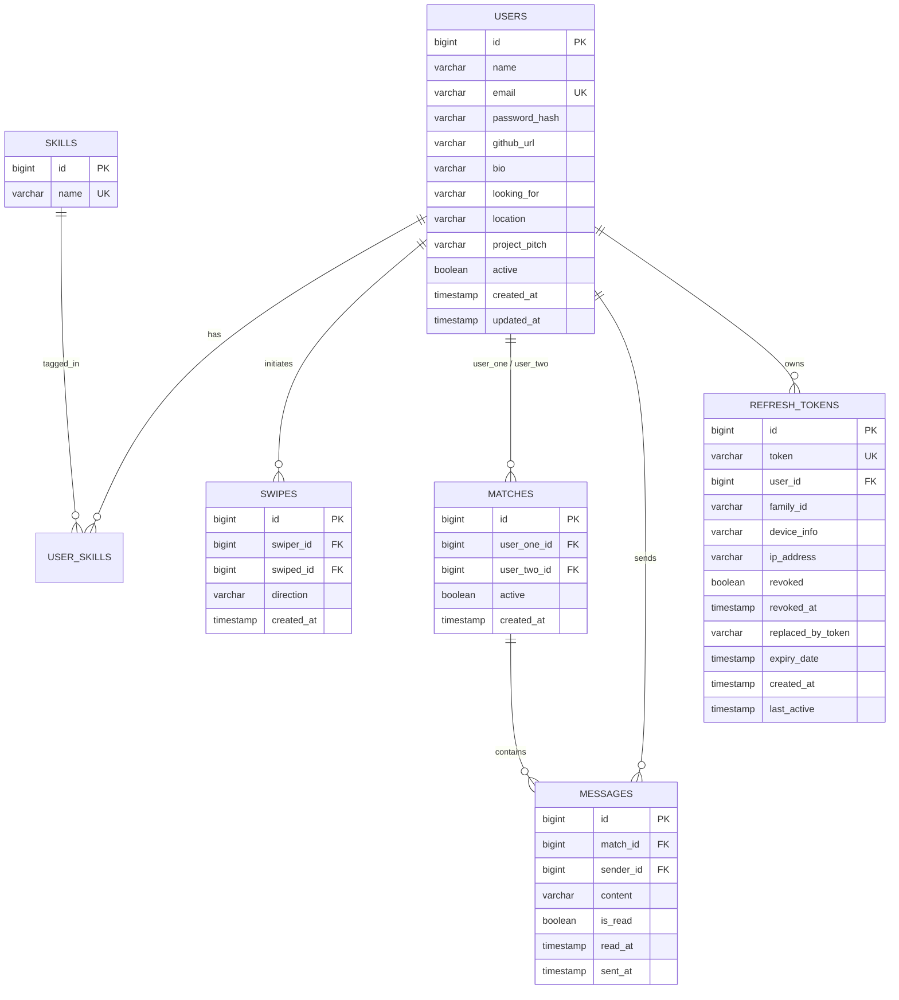

# Devlynix (DevTinder) — Backend API & Real-Time Matchmaking Service

> **Developed for Devlynix Buildathon 2.0 (72-hour Hackathon)**  
> Teammate and project partner matchmaking platform designed for developers and hackathon participants. Swipe on developer cards, discover complementary skill sets, match when interest is mutual, and collaborate in real-time.

---

## 🚀 Live Deployments & Cross-Links

- **Frontend Web App (Live):** [Devlynix on Vercel](https://devlynix-frontend12-git-main-hxmblevishus-projects.vercel.app/)
- **Frontend Source Code:** [devlynix-frontend Repository](../devlynix-frontend)
- **Backend API Base:** `https://devlynix-buildathon-2-0.onrender.com/api`
- **Health Check Endpoint:** `https://devlynix-buildathon-2-0.onrender.com/api/health`

---

## 🛠 Tech Stack

- **Core Framework:** Java 21 (LTS) & Spring Boot 3.3.5
- **Security & Identity:** Spring Security 6, JJWT (`0.12.6`), BCrypt Password Encoder
- **Token Architecture:** Refresh Token Rotation (RTR) with Token Family Replay/Theft Detection & Multi-Device Session Telemetry
- **Database & Persistence:** PostgreSQL 16 (Neon Cloud / Local), Spring Data JPA, Hibernate ORM
- **Real-Time Communication:** Spring WebSocket, STOMP Protocol, SockJS fallback, REST Delta Sync
- **Reliability & Rate Limiting:** Sliding-Window In-Memory Rate Limiting (`RateLimitFilter`, 60 req/min), CORS mapping
- **Scheduled Workers:** Automated background hourly database purges (`@Scheduled`) for expired/stale tokens
- **Containers & DevOps:** Docker (Multi-stage build), Docker Compose, GitHub Actions CI/CD
- **Testing:** JUnit 5, H2 Database (PostgreSQL mode), `MatchServiceTest` integration suite

---

## 🏗 Architecture & System Overview

```
                      +---------------------------------------+
                      |   Next.js Frontend (Vercel)           |
                      |   Retro Cassette UI / Adaptive Polling|
                      +-------------------+-------------------+
                                          |
                        HTTPS (REST API)  |   WSS (STOMP / SockJS)
                                          v
+-------------------------------------------------------------------------------+
|                        Devlynix Spring Boot 3.3 Backend                       |
|                                                                               |
|  [RateLimitFilter] -> [JwtAuthenticationFilter] -> [Spring Security Chain]    |
|                                                                               |
|   +-------------------+  +--------------------+  +-------------------------+  |
|   |  AuthController   |  | DiscoverController |  |     ChatController      |  |
|   |  (Login/RTR/Sess) |  | (Feed / Swiping)   |  | (Delta Sync / Messages) |  |
|   +-------------------+  +--------------------+  +-------------------------+  |
|   |  ProfileController|  |  MatchController   |  |   ChatMessageHandler    |  |
|   |  (Self Management)|  |  (Mutual / Requests|  |   (WebSocket @Message)  |  |
|   +-------------------+  +--------------------+  +-------------------------+  |
|                                                                               |
|                   [SimpleBroker: /topic/matches/{matchId}]                    |
+---------------------------------------+---------------------------------------+
                                        |
                            Spring Data JPA (Hibernate)
                                        |
                                        v
                        +---------------------------------+
                        |      PostgreSQL Database        |
                        | (Users, Skills, Swipes, Matches,|
                        |    Messages, Refresh Tokens)    |
                        +---------------------------------+
```

---

## 🎯 Key Features & How They Work

### 1. Skill-Based Discovery & Smart Ranking
- The discover feed query (`UserRepository.findDiscoverableUsers`) filters out:
  1. The requesting user.
  2. Inactive accounts.
  3. Developers the current user has already swiped on (`LIKE` or `PASS`).
- **Dynamic Relevance Ranking:** Matches candidates based on shared skills (`sharedSkillCount`) in descending order so the most compatible collaborators appear first.
- **Skill Filter & Pagination:** Query by specific tech stacks with page & size parameters:
  `GET /api/discover?skill=react&page=0&size=50`.
- **Pass Reset (Queue Rewind):** When candidates run out, users can reset their skipped candidates via `DELETE /api/discover/reset-passes`.

### 2. Mutual Match & Incoming Signal Radar
- Swiping (`POST /api/discover/swipe`) supports `LIKE` and `PASS`.
- State is tracked in the `swipes` table with a composite constraint `(swiper_id, swiped_id)`.
- When User A swipes `LIKE` on User B:
  - If reciprocal interest exists: A `Match` record is instantly generated.
  - If one-way: Returns `isMatch: false`.
- **Incoming Match Requests:** User B can inspect developers who liked them before swiping via `GET /api/matches/requests`.
- **Unmatching:** Users can disconnect anytime via `DELETE /api/matches/{matchId}` (purging mutual records and associated messages).

### 3. Refresh Token Rotation (RTR) & Hacker Theft Defense
- **Dual-Token System:** 
  - Access Token: Short-lived (10–15 mins), held in client memory/storage.
  - Refresh Token: Cryptographically secure 64-byte random string (`SecureRandom`), valid for 7 days.
- **Token Family Architecture:**
  - Every login assigns a unique `familyId`.
  - When refreshed, the old token is marked `revoked = true` with a timestamp, recording `replacedByToken`.
  - **Replay / Compromise Attack Detection:** If a malicious party steals a spent refresh token and attempts to reuse it, the server detects token reuse and **instantly revokes the entire `familyId`**, logging out the attacker and the user across that device session.
- **Multi-Device Session Telemetry:**
  - Parses client `User-Agent` and logs client IP.
  - Users can view all active logins, revoke a specific remote device, or terminate all other devices remotely.
- **Automated Cleanup:** An `@Scheduled` task runs hourly, purging expired tokens and revoked records older than 24 hours.

### 4. Real-Time Chat & Delta Synchronization
- **STOMP WebSocket:** Real-time push over `/topic/matches/{matchId}` with destination `/app/chat.send`.
- **REST Delta Sync:** Optimized HTTP polling with `GET /api/chat/{matchId}/messages?after={id}&limit=100` so clients only fetch newly arrived messages.
- **Read Receipts:** Track and mark unread messages via `PUT /api/chat/{matchId}/read`.
- **Chat Purge:** Wipe conversation history via `DELETE /api/chat/{matchId}/messages`.

### 5. Sliding-Window Rate Limiting
- Custom `RateLimitFilter` tracks request volume per client IP across a 60-second sliding window (`RATE_LIMIT_REQUESTS_PER_MINUTE: 60`).
- Emits standard RFC headers (`X-RateLimit-Limit`, `X-RateLimit-Remaining`, `X-RateLimit-Reset`) and returns HTTP `429 Too Many Requests` on breach.

---

## 🗄 Database Schema (ERD)



---

## 📡 Complete REST API Reference

### 🔐 Authentication & Session Management (`/api/auth`)

| Method | Endpoint | Description | Auth Required |
|---|---|---|---|
| `POST` | `/api/auth/register` | Register a new developer account | No |
| `POST` | `/api/auth/login` | Authenticate and obtain access + refresh tokens | No |
| `POST` | `/api/auth/refresh` | Rotate refresh token and issue new access token | No (Refresh Token) |
| `POST` | `/api/auth/logout` | Revoke current session refresh token | Bearer Token |
| `POST` | `/api/auth/logout-all` | Revoke all active sessions across all devices | Bearer Token |
| `GET` | `/api/auth/sessions` | List all active sessions with device/IP telemetry | Bearer Token |
| `DELETE` | `/api/auth/sessions/{id}` | Terminate a specific remote device session | Bearer Token |
| `POST` | `/api/auth/sessions/terminate-others`| Revoke all sessions except the active one | Bearer Token |

**Login / Register Response:**
```json
{
  "accessToken": "eyJhbGciOiJIUzI1NiIsInR5cCI6IkpXVCJ9...",
  "refreshToken": "a8f3b20194c749a2b7e19385d8...",
  "tokenType": "Bearer",
  "profile": {
    "id": 1,
    "name": "Jane Developer",
    "email": "jane@example.com",
    "githubUrl": "https://github.com/janedev",
    "bio": "Full-stack developer building AI agents.",
    "lookingFor": "Hackathon teammates & open-source collaborators",
    "location": "Remote / Bengaluru",
    "skills": ["Java", "Spring Boot", "React", "PostgreSQL"]
  }
}
```

---

### 👤 Profile Management (`/api/profile`)

| Method | Endpoint | Description | Auth Required |
|---|---|---|---|
| `GET` | `/api/profile/me` | Fetch authenticated user profile | Bearer Token |
| `PUT` | `/api/profile/me` | Update bio, location, goals, and skills | Bearer Token |
| `PATCH` | `/api/profile/me` | Partial update profile fields and skills | Bearer Token |

---

### 🔍 Discovery & Matching (`/api/discover` & `/api/matches`)

| Method | Endpoint | Description | Auth Required |
|---|---|---|---|
| `GET` | `/api/discover` | Discover unswiped developers (`?skill=&page=&size=`) | Bearer Token |
| `POST` | `/api/discover/swipe` | Swipe on a developer (`LIKE` or `PASS`) | Bearer Token |
| `DELETE` | `/api/discover/reset-passes` | Reset skipped candidates to re-evaluate queue | Bearer Token |
| `GET` | `/api/matches` | Get list of all mutual matches with unread counts | Bearer Token |
| `GET` | `/api/matches/requests` | Get incoming connection requests (Signal Radar) | Bearer Token |
| `DELETE` | `/api/matches/{matchId}` | Unmatch and sever connection with user | Bearer Token |

**Swipe Payload:**
```json
{
  "targetUserId": 2,
  "direction": "LIKE"
}
```

---

### 💬 Chat & Messaging (`/api/chat`)

| Method | Endpoint | Description | Auth Required |
|---|---|---|---|
| `GET` | `/api/chat/{matchId}/messages` | Get chat messages (`?after={id}&limit=100`) | Bearer Token |
| `POST` | `/api/chat/{matchId}/messages` | Send message via REST endpoint | Bearer Token |
| `PUT` | `/api/chat/{matchId}/read` | Mark incoming unread messages as read | Bearer Token |
| `DELETE` | `/api/chat/{matchId}/messages` | Clear chat history for this match | Bearer Token |

---

### ⚡ WebSocket (STOMP) Guide

- **Connection URL:** `wss://<domain>/ws` (or SockJS `https://<domain>/ws`)
- **Broker Destination:** `/topic/matches/{matchId}`
- **Application Inbound Prefix:** `/app/chat.send`

```javascript
import SockJS from 'sockjs-client';
import Stomp from 'stompjs';

const socket = new SockJS('https://devlynix-buildathon-2-0.onrender.com/ws');
const stompClient = Stomp.over(socket);

stompClient.connect({}, () => {
    stompClient.subscribe(`/topic/matches/${matchId}`, (msg) => {
        const payload = JSON.parse(msg.body);
        console.log('New message:', payload);
    });
});
```

---

## 💻 Local Development Setup

### Prerequisites
- **Java 21 JDK** (`java -version`)
- **Maven 3.9+** (`mvn -version`)
- **Docker & Docker Compose** (or local PostgreSQL 16)

### Running with Docker Compose (Fastest)
```bash
docker compose up --build
```
Live at `http://localhost:8080`. PostgreSQL runs on port `5432`.

### Running with Local Maven
1. Create PostgreSQL database:
   ```sql
   CREATE DATABASE devtinder;
   ```
2. Copy `.env.example` to environment variables:
   ```bash
   cp .env.example .env
   ```
3. Run the application:
   ```bash
   mvn clean spring-boot:run
   ```
4. Run integration tests:
   ```bash
   mvn test
   ```

---

## 🌐 Cloud Deployment (Render + Neon)

- **Database:** Hosted on [Neon.tech](https://neon.tech) (PostgreSQL 16 serverless).
- **Service:** Hosted on [Render.com](https://render.com) as a Docker web service.
- **Continuous Delivery:** Configured via `.github/workflows/ci-cd.yml` triggering on push to `main` with `RENDER_DEPLOY_HOOK_URL`.

---

## 🔮 Future Enhancements

- [ ] **Interactive Swagger/OpenAPI:** Integrate `springdoc-openapi-starter-webmvc-ui` for live `/swagger-ui.html`.
- [ ] **Database Migration Tool:** Migrate from Hibernate DDL auto to **Flyway**.
- [ ] **Distributed Rate Limiting:** Replace in-memory rate limiter with **Redis** for multi-instance scaling.
- [ ] **Cloudinary Avatar Uploads:** Allow users to upload custom avatars alongside GitHub profile resolution.
- [ ] **AI Skill Complementarity:** Compute synergistic team match scoring using machine learning embeddings.

---

## 👨‍💻 Author

**Nikunj Garg**  
- **Email:** [gargnikunj991@gmail.com](mailto:gargnikunj991@gmail.com)  
- **Portfolio:** [nikunjgarg.xyz](https://nikunjgarg.xyz)  
- **GitHub:** [@gargnikunj991-ux](https://github.com/gargnikunj991-ux)  
- **LeetCode:** [@Nikunjgarg12](https://leetcode.com/Nikunjgarg12)